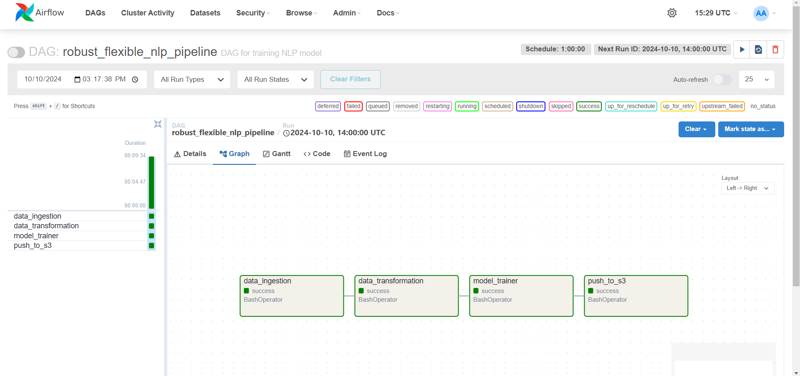

# 🔍 End-to-End Hate Speech Classification NLP Pipeline


Welcome to the **End-to-End Hate Speech Classification NLP Pipeline Project**! This project demonstrates a complete MLOps implementation for detecting hate speech using a **BERT**-based deep learning model. The pipeline is automated with tools like Airflow, MLflow, Docker, and AWS S3, achieving 94% model accuracy.

<p align="center">
  
<!--   
   -->
</p>

---

## 🚀 Project Summary

This project focuses on hate speech classification using **NLP** techniques powered by **BERT**. It is built and deployed in a fully automated MLOps pipeline, orchestrated using **Apache Airflow** and version-controlled with **MLflow** and **DVC**.

The entire pipeline is hosted on **AWS EC2** and leverages **Docker** containers for all services, ensuring seamless, reproducible deployments.

---

## 📚 Features

### 🔄 End-to-End Pipeline Automation
- Automated tasks for **Data Ingestion, Preprocessing, Model Training, and Model Deployment** using Airflow DAGs.
- Trained a **BERT-based model** on a hate speech dataset, achieving 94% accuracy.
- Automated logging and tracking of experiments using **MLflow**, including performance metrics and model artifacts.

### 🧬 Model Versioning with MLflow
- **MLflow** tracks all experiments, hyperparameters, and performance metrics, making it easy to compare different model versions.
- Ability to quickly deploy the best-performing model with version control.

### 📦 Containerized Deployment with Docker
- Each service (Airflow, MLflow, and Flask) runs inside **Docker containers**, ensuring consistent environments for development, testing, and production.
- The system can be easily scaled and deployed across different environments.

### ☁️ AWS S3 Storage and EC2 Hosting
- **AWS S3** is used for storing datasets and model artifacts, ensuring efficient and secure data management.
- The pipeline is hosted on **AWS EC2** instances, with containerized images managed on **DockerHub** and **AWS ECR**.

### 📡 REST API for Predictions
- A **Flask** application serves the trained model via a REST API, allowing external applications to send `POST` requests and get predictions for hate speech classification.
- Input: Text data. Output: Binary classification indicating whether the text contains hate speech or not.

### CI/CD Pipeline using GitHub Actions
- **Continuous Integration (CI)** workflow ensures code quality by running tests on every push.
- **Continuous Deployment (CD)** automates building Docker images and deploying them on **AWS EC2**.
- CI/CD process also manages container image versioning using **AWS ECR** and **DockerHub**.

---

## 🧰 Tech Stack

<p align="center p-3">
  
  
  
  
  
  
  
  
  
  
  
</p>

- **Languages & Frameworks**: Python, Flask, BERT (via Huggingface Transformers)
- **Containerization**: Docker
- **Container Registry**: DockerHub, AWS ECR
- **Pipeline Orchestration**: Apache Airflow
- **Experiment Tracking**: MLflow
- **Data Version Control**: DVC
- **Cloud Infrastructure**: AWS EC2, S3
- **CI/CD**: GitHub Actions

---

## 🛠 Steps to Reproduce the Project

### 1. Clone the Repository
```bash
git clone https://github.com/yourusername/Hate-Speech-Classification-Pipeline.git
cd Hate-Speech-Classification-Pipeline

```
### 2. Build and Run the docker container using Docker compose
```bash
docker compose up

```

### 3. Optional Step : If you have GPU and want to leverage it, stop the container and run it again .

`Ctrl+C`


```bash
docker run -p 8080:8080 --gpus all --runtime=nvidia airflow:local 

```
